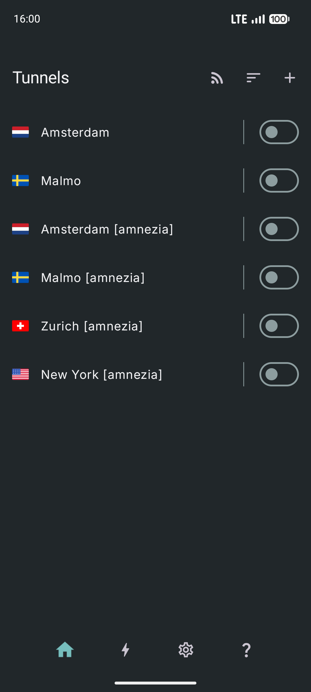
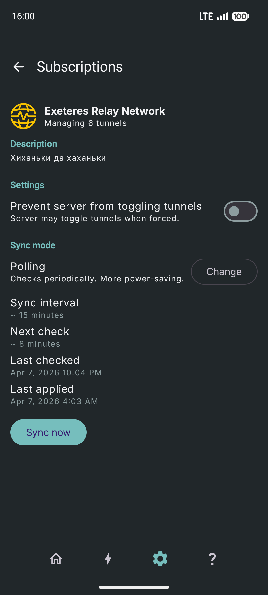

# WG Tunnel with wg-feed support

This is an experimental fork of [WG Tunnel](https://github.com/wgtunnel/wgtunnel)
with support for [wg-feed](https://github.com/Exeteres/wg-feed).

It also adds support for custom icons and descriptions for tunnels just for fun!

## Screenshots

<table>
  <tr>
    <td></td>
    <td></td>
  </tr>
</table>

## Installation

Just download and install the latest apk from [releases](https://github.com/Exeteres/wg-feed-android/releases).

## License

This project is licensed under the MIT License like the original WG Tunnel.
